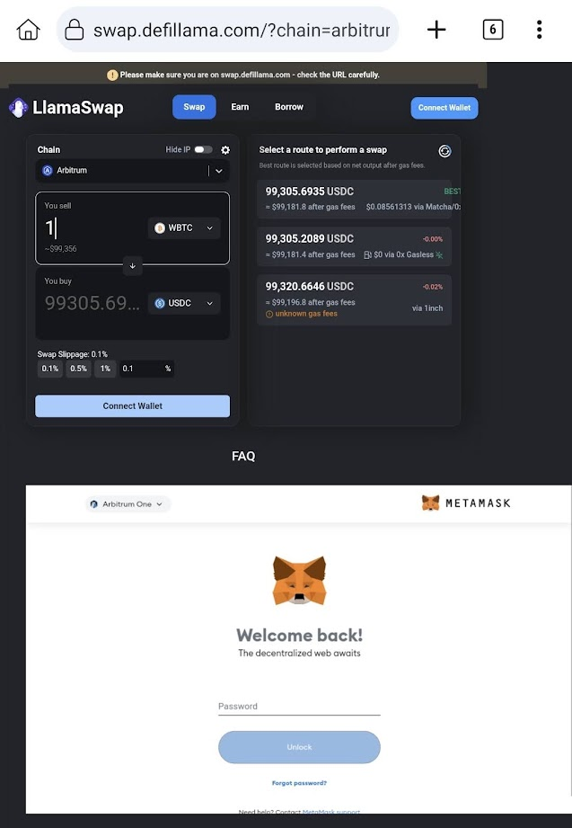

kiwi browser + self-customized metamask(transaction preview) is safer than a harware wallet!

On your google pixel android phone, download 2 files of "Source code (zip)" and "metamask-chrome-12.1.0.mod.zip" from: https://github.com/diyism/TabRevivePro_metamask/releases/

Click "Extension" on the kiwi browser menu, click "Developer mode" at top-right, click "+(from .zip/.crx/.user.js)", select the zip file and install it

Click "TabRevicePro" on the kiwi browser menu, check the "Active/In Active" box, check the "Keep Metamask Active" box, and click "Save Settings"

The main modification to TabRevivePro:
    
    chrome.tabs.query({ url: "chrome-extension://nkbihfbeogaeaoehlefnkodbefgpgknn/home.html" }, function (tabs) {
          tabs.forEach(function (tab) {
            tab.autoDiscardable=false;
            chrome.tabs.update(tab.id, { autoDiscardable: false });
          });
          for (let prop in tabs[0]) {
            console.log(`${prop}: ${JSON.stringify(tabs[0][prop], null, 2)}`);
          }
    });

    //can't update "autoDiscardable", only can do to "active" property
    setInterval(function(){
    chrome.tabs.query({ url: "chrome-extension://nkbihfbeogaeaoehlefnkodbefgpgknn/home.html" }, function (tabs) {
          active_tab_id=0;
          chrome.tabs.query({ active: true}, function(active_tabs){
            active_tab_id=active_tabs[0].id;
          });
          chrome.tabs.update(tabs[0].id, { active:true});
          setTimeout(function(){chrome.tabs.update(active_tab_id, { active:true});}, 1000);
    });
    }, 30000);

# TabRevivePro Chrome Extension

Revive: Keep inactive tabs alive in Chrome. Preserve pages without refreshing or reloading, boosting productivity.

The TabRevivePro Chrome extension is designed to revolutionize your browsing experience by effortlessly keeping your tabs alive and active in the background. Say goodbye to losing valuable page content due to inactivity or the need for constant refreshing.

## Key Features

- **Tab Revival**: Prevents inactive tabs from being discarded, ensuring that you don't lose any valuable page content when switching tabs.

- **Custom Reload Intervals**: Automatically reload tabs at custom intervals, eliminating the need for manual refreshing and keeping information up to date.

- **Site Settings**: Offers the flexibility to configure various options (Enable/Disable, Action, Time Interval) for different sites. Stay in control of your browsing experience with ease.

## How to Use

1. Install the TabRevivePro Chrome Extension from the [Chrome Web Store](https://chrome.google.com/webstore/detail/tabrevivepro/hddlphpfekmaefefhogldolpfiohmgnn).

2. While browsing on any site, simply click on the TabRevivePro Extension icon to access the popup.

3. Effortlessly configure settings for the active site in the popup.

4. Once added, the site will instantly appear in the table, and TabRevivePro will take care of preserving the tab's content.

## License

TabRevivePro is released under the [MIT License](LICENSE).

Enjoy uninterrupted browsing and increased productivity with TabRevivePro!
